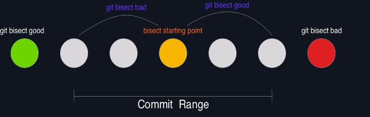
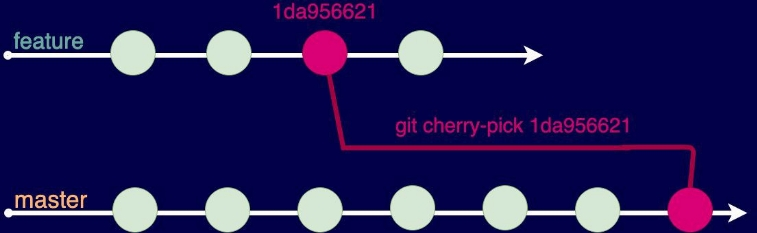
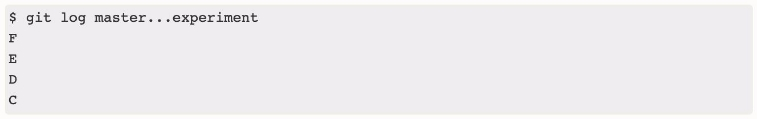
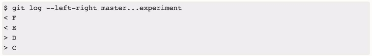

Mike Kilic - Udemy Instructor

GIT CHEAT-SHEET: GIT MASTERY

[**Git commands Overview](#_page2_x13.51_y13.51) **3**

[git add ](#_page3_x13.51_y13.51)4 [git bisect ](#_page3_x13.51_y310.76)4 [git blame ](#_page4_x13.51_y13.51)5 [git branch ](#_page4_x13.51_y321.27)5 [git checkout ](#_page5_x13.51_y13.51)6 [git cherry-pick ](#_page6_x13.51_y13.51)7

[git clean ](#_page6_x13.51_y328.78)7 [git clone ](#_page6_x13.51_y545.71)7 [git commit ](#_page7_x13.51_y323.52)8 [git config ](#_page8_x13.51_y13.51)9 [git diff ](#_page8_x13.51_y428.61)9 [git fetch ](#_page9_x13.51_y267.22)10 [git gc ](#_page9_x13.51_y491.66)10 [git gui ](#_page9_x13.51_y617.77)10 [git grep ](#_page11_x13.51_y13.51)11 [git init ](#_page11_x13.51_y415.85)11 [git ls-files ](#_page11_x13.51_y591.50)11

[git log ](#_page12_x13.51_y13.51)12 [git merge ](#_page14_x13.51_y481.15)14 [git merge-base ](#_page16_x13.51_y13.51)16 [git merge-file ](#_page16_x13.51_y71.31)16

[git mergetool ](#_page16_x13.51_y253.71)16 [git mv ](#_page16_x13.51_y424.11)16 [git pull ](#_page16_x13.51_y529.95)16 [git push ](#_page17_x13.51_y208.67)17 [git rebase ](#_page18_x13.51_y13.51)18 [git reflog ](#_page18_x13.51_y322.02)18 [git remote ](#_page18_x13.51_y492.41)18 [git reset ](#_page19_x13.51_y42.79)19 [git restore ](#_page19_x13.51_y368.56)19 [git revert ](#_page19_x13.51_y692.08)19 [git rev-list ](#_page20_x13.51_y281.48)20

[git rm ](#_page20_x13.51_y623.77)20 [git shortlog ](#_page21_x13.51_y13.51)21 [git show ](#_page21_x13.51_y319.77)21 [git stage ](#_page21_x13.51_y544.21)21 [git status ](#_page21_x13.51_y585.49)21 [git submodule ](#_page22_x13.51_y13.51)22 [git subtree ](#_page22_x13.51_y463.89)22 [git switch ](#_page23_x13.51_y13.51)22 [git tag ](#_page23_x13.51_y173.39)23

[**Revision syntax ](#_page24_x13.51_y13.51)**23**

[**git-Konfiguration ](#_page25_x13.51_y13.51)**25 [Configuration file .git/config ](#_page25_x13.51_y107.34)**25

[Basic settings ](#_page25_x13.51_y494.66)25 [Configuration file .gitignore ](#_page26_x13.51_y248.46)26 [Configuration file .gitmodules ](#_page26_x13.51_y556.22)26 [Configuration file .gitattributes ](#_page26_x13.51_y653.80)26

[**Git problems and their solution ](#_page27_x13.51_y13.51)**27**

[Repository not found ](#_page27_x13.51_y192.16)27 [Please tell me who you are (git commit) ](#_page27_x13.51_y319.77)27 [Authentication failed (git pull, git push) ](#_page27_x13.51_y436.12)27 [Invalid username or password (git clone, git pull, git push) 28 ](#_page28_x13.51_y13.51)[Permission denied / publickey (git clone, git pull, git push) 28 ](#_page28_x13.51_y121.60)[Permission denied, unable to access <Repository> (git push) ](#_page28_x13.51_y213.93)28 [Changes not staged for commit (git commit) ](#_page28_x13.51_y355.80)28 [Your branch is ahead of remote/branch by n commits (git pull, git status) 29 ](#_page29_x13.51_y13.51)[You are in detached HEAD state (git checkout) ](#_page29_x13.51_y123.85)29

[Please enter a commit message to explain why this merge is necessary (git pull) 29](#_page29_x13.51_y232.70)

[Cannot pull with rebase – you have unstaged/uncommitted changes (git pull) 29 ](#_page29_x13.51_y407.59)[There is no tracking information for the current branch (git pull) 29 ](#_page29_x13.51_y608.01)[Your local changes would be overwritten (git merge, git pull) 30 ](#_page30_x13.51_y13.51)[Failed to push some refs to <Repository URL> (git push) ](#_page30_x13.51_y138.87)30 [The current branch <BranchName> has no upstream branch (git push) 30 ](#_page30_x13.51_y264.22)[Merge failed, merge conflict in <file> (git merge etc.) ](#_page30_x13.51_y389.58)30

[**Markdown Syntax](#_page31_x13.51_y13.51) **30**

*Git commands Overview*

Please note that the commands listed below are in alphabetical order. There are more additional options to most commands, but I’m just showing you the ones I believe are the most useful. Please only use this provided Cheat-Sheet as a reference in addition to the course, otherwise some commands and options will just be gibberish to you and not make any sense.

If there is any mistake in this Cheat-Sheet please let me know by sending me a message on Udemy or simply in the QA-Section of where you downloaded this file.

For those of you who now might ask how long this course took me to prepare with all the animated slides + videos + Cheat Sheet. This whole course took me about ​**5 Months​** to prepare so around an estimated **160-180 hours ​**while working on a full-time job. If you already haven't done so, I would appreciate it if you could leave me a rating. I make all of these classes myself - there is no big company or corporation behind these. If there is anything I can do, to make this course better please let me know so I can keep this course updated and make it better for all of us.

git add

git add <files> marks files to be included in the next commit. Instead of ​git add <files>, you can also run the equivalent command ​git stage <files>.

If there has been only changes to files that are already under Git control (files that have been previously at some point been added with ​git add <files>) you don't need to run ​git add <files> if you pass the ​-a option to ​git commit.

Examples

git add file1.txt

git add . (Will include all changes starting from the directory upwards) git add --all (All changes will be included)

git add --force (Will ignore entries in the .gitignore file)

To exclude an already marked file from the commit, execute ​git reset <file> ​or ​git reset (Will unmark all files). ​git status gives an overview of all new or changed files and shows which of these files are marked for the commit and which are not.

git bisect

git bisect helps to find the one out of hundreds of commits in which the error xyz occurred for the first time. First the newest and the oldest commit to be considered must be specified. ​git bisect then performs a binary search, i.e. halves the number of commits that still have to be searched with each step.

- git bisect start activates the bisecting mode.
- git bisect good <goodrev> gives the latest known version where the bug did not occur yet.
- git bisect bad <badrev> specifies the code version where the error occurs.

Once the start and end points of the search range are known with ​<goodrev> and ​<badrev>​, git does a checkout in the middle of that range. You now need to test if the error also occurs in this version of your program and tell git with:

- git bisect good or ​git bisect bad continues the search. (This process, i.e. testing the version just selected by git bisect and returning good or bad, repeats until git bisect succeeds in finding the faulty commit. For a search range of 500 commits, a maximum of 10 steps are required.)
- git bisect ​reset exits bisecting mode. This returns you to the branch that was active at startup and you can now get to work fixing the bug.

Illustration

git blame

git blame <file> displays a file. Several columns before each line indicate in which commit (hashcode) the file was changed, when and by whom.

In the form git blame ​<revision> -- <file>, git blame only considers commits up to the specified revision. (See revision section after git commands further down the file).

Use those various options to control the output:

- --color-by-age marks recently changed lines in red or white color.
- --color-lines marks lines from the same commit in light blue color.
- -L <n1>,<n2> displays only the lines with numbers from ​n1 to ​n2.

(Alternatively use ​-L 50,+11 also displays the lines 50 to 60.)

Examples

git blame index.php

git blame --color-by-age index.php git blame -L 20,45 index.php

git branch

git branch without any further parameters or options lists all local branches and marks the currently active branch with the ​\*​ character.

git branch <newbranch> creates a new branch, but does not activate it. To do this, you must also run git checkout <newbranch> or ​git switch <newbranch>. Alternatively, you can use ​checkout -b <newbranch> to create and activate the branch at the same time.

Use those various options to control the output:

- a or ​--all displays not only the local branches but also those of external repositories.
- -d <branchToDelete> deletes the specified branch. The associated commits are preserved. However, the commits of deleted, never merged branches that have no references by other branches will be deleted in the next garbage collection (​git gc).
- --merged or ​--no-merged shows only branches that have already been merged with the current branch or that have not yet been merged. By default, ​git branch --merged tests if the heads of the branches match HEAD. (HEAD is the most recent commit in the active branch. )
- -m <oldname> <newname> or ​--move <old> <new> renames a branch.
- -r or ​--remotes displays only those from external repositories instead of local branches.

Examples

git branch

git branch -all

git branch --no-merged

git branch -m <oldName> <newName> git branch --remotes

git checkout

git checkout performs a confusingly large number of tasks. The main variants for calling the command look like this:

- git checkout <branch> switches to the specified branch. All files under revision control that had different contents in the last commits of the current branch and the new branch are overwritten. Changed files that had the same state in each of the last commits, on the other hand, are preserved. If there is a risk that changes will be overwritten, the command aborts the operation. To bypass this behaviour using​ -f or ​--force forces the checkout even then. ​**Caution:​** The overwritten changes cannot be restored afterwards.
- git checkout -b <newBranch> creates a new local branch and activates it.
- git checkout <revision> -- <file> overwrites the ​<file> file with the version from the <revision> commit. The revision is optional. If it is omitted, ​git checkout simply applies to the last commit. This revokes the changes made to the file since the commit.

The ​--patch additional option runs git checkout interactively. You can decide for each changed code block whether it should be applied or not. This gives you the option not to apply all changes, but only selectively the ones you are interested in. (Type​ ? afterwards to see explanations)

- git checkout <revision> works similar to ​git checkout <branch> and restores the project directory to the state it was in the ​<revision> commit. The main difference is that there is no longer an active branch after the command is executed (Detached HEAD). This means that only HEAD points to the specific commit, but not the Head of a branch. Future commits are thus not assigned to a branch. This checkout variant is useful if you want to take another look at the state of the project at the time of a past commit, or if you want to start a new branch based on that commit. In the first case, you return to an existing branch with ​git checkout <existingBranch>, in the second case you start a new branch with ​git checkout -b <newBranch>.
- In case of a merge conflict, ​git checkout --ours <file> or ​git checkout --theirs <file> overwrites the specified file with the version of its own path or with the version of the other path.

**Caution:​** If a merge conflict occurs during a rebasing operation, the meaning of ​--ours and --theirs is reversed! ​--theirs denotes the "own" commits, ​--ours the foreign commits.

**With August 2019, there are alternative commands for certain uses of ​**git checkout**:**

- Like ​git checkout <branch>, ​git switch <branch> switches the active branch.
- git restore -s <revision> <file> restores the specified file from the commit expressed by ​<revision>. So the command is equivalent to ​git checkout <revision> -- <file>.

Examples

git checkout existingBranch

git checkout -b newBranch

git checkout 12b986207 -- index.php

git checkout c2381608d (​**Caution: ​**Detached HEAD)

git checkout --ours index.php (​**Caution: ​**Merging/Rebasing different meanings!)

git cherry-pick

git cherry-pick <revision> applies the changes made in the specified commit to the current branch. There must be no files in the project directory that have changed since the last commit. You may need to commit or ​git stash beforehand. If there is a merge conflict within ​git cherry-pick, you need to fix it and confirm the change with ​git commit.

Illustration

git clean

git clean deletes all files in the current directory that are neither under version control nor protected by *.gitignore​*. This cleanup is an extremely dangerous operation because the files cannot be recovered. If you decide to run the command please use the ​--dry-run option!

- -d also deletes recursively through all subdirectories. (For security reasons, git clean ignores subdirectories by default).
- -f or ​--force forces the deletion. (This option must be specified unless the ​git config clean.requireForce false setting applies).
- -n or ​--dry-run prints the files to be deleted, but does not touch the files.
- -x also deletes files that are included in ​*.gitignore​*.

**I don’t recommend using this command!**

git clone

git clone creates a copy (a "clone") of another repository. Typically, you pass ​git clone the address of a remote repository (be as on GitHub, GitLab, …). You can choose between HTTPS and SSH protocols.

In general form, the URLs look like this:

- git clone https://<hostname >/<account>/<repoName>.git
- git clone <user>@<hostname>:<account>/<repoName>.git

git clone can also copy a repository of the local machine. In this case, authentication is not required:

- git clone path/to/repo

git clone creates a new subdirectory in the current directory with the same name as the repository. If you want the name of the new subdirectory to be different from the repo name, you can specify it explicitly:

- git clone https://github.com/facebook/react.git my-repo-dir

The behavior of git clone can be influenced by countless options, of which we list only the most important ones here:

- --bare sets up the copy in the local directory, so it does not create a subdirectory. Only the actual repository is copied there (i.e. the files that would otherwise be in the .git subdirectory). No checkout from HEAD is performed.
- --mirror works similarly to ​--bare, but also takes into account external branches and references. The goal is to create a complete copy of the external repository.
- --recurse-submodules also takes submodules into account. This is equivalent to running

git submodule update --init --recursive immediately after the clone is finished.

Examples

git clone https://github.com/facebook/react.git

git clone https://github.com/facebook/react.git newName

git clone --bare https://github.com/facebook/react.git

git clone --recurse-submodules https://github.com/facebook/react.git

git commit

git commit takes a snapshot of all files under version control in the local repository. Along with the state of the files, the date and time of the snapshot are stored, along with your name and email address and a message, the commit message. ​git commit normally only considers files that have been explicitly marked for commit using ​git add or ​git stage. (Note the ​-a option!).

- -a or ​--all automatically takes into account all changes to files that were already under version control, i.e. for which ​git add was run at some point in the past. The option has no effect on new files that have not been versioned yet.
- --amend merges the last commit with the changes made since then to form a new commit that replaces the previous commit. ​git commit --amend thus makes it possible to include previously forgotten changes or subsequent corrections in the last commit. Since the command changes the history, you should only use ​--amend if you have ​**not yet uploaded​** the last commit to a remote repository!
- --dry-run simulates the commit, but does not actually perform it.
- -m '<text>' bzw.​ --message '<text>' specifies the commit message. If you leave this option out a window will pop up that will ask you for the commit message.
- -n or ​--no-verify prevents the pre-commit and commit-msg hooks from being called.

Commits are only valid locally! To make the commit visible in an external repository, you must then run git push.

To revert the last commit, run ​git revert HEAD. This will create a new commit. If you have not yet committed the current branch to other repositories with ​git push, you can revert to the previous commit with ​git reset --hard HEAD~.

Examples

git commit -a -m ‘Initial commit’

git commit -a --amend ‘Use this only if changes are not in remote Repository!’

git config

git config reads the Git configuration or modifies the ​.git/config files in the local repository, .gitconfig in the home directory, or ​/etc/gitconfig (or under Windows Program Files\Git\etc\gitconfig​). This is just the syntax for ​git config, to have a more detailed view, there is a own section towards the end of this Cheat-sheet.

- -e or​ --edit opens the configuration file in an editor.
- --get <keyname> reads only this one setting (not all).
- --get-regexp <pattern> lists all settings that match the search pattern.
- --global reads/modifies the personal configuration (​~/.git/config).
- -l or ​--list lists all valid settings. These consist of system-wide, global, and local settings, with local settings taking precedence. With the additional option ​--show-origin the command shows which configuration file contains which setting.
- --local reads/modifies the configuration of the local repository (​.git/config).

The two main uses of the command are to list all settings or to change a single setting. (Please see the git-configuration section at the end for more info!)

Examples

git config --list --show-origin

git config -e

git config --get user.email git config -l --global

git diff

Depending on how it is used, ​git diff shows the differences between two versions of a file, or any changes that make two commits different from each other. The main uses of the command look like this:

- git diff without further parameters shows all modified lines in all files modified since the last commit. By default, ​git diff compares the project directory with the last commit. If you want to compare the stage area with the last commit instead, specify the​ --cached or​ --stage option as well.
- git diff <file> shows only the change of the specified file
- git diff <revision> [<file>] shows all changes between the specified commit and the current state in the project directory.
- git diff <revision1>..<revision2> [file] shows the changes between two commits.
- git diff <rev1>...<rev2> [file] with three dots between revisions shows the changes in revision 2 compared to the last common base. For example, ​git diff master...develop returns the changes in develop since the last merge with master. However, unlike master..develop, the changes made in master since then are ignored.
- git diff --no-index <file1> <file2> compares the two files. In this form, the command also works outside of a Git repository.

The output of ​git diff can be controlled by various options:

- --compact-summary displays only a summary instead of the patches, where the number of characters + and - corresponds to the number of lines added and deleted.
- --diff-filter=A|C|D|M|R processes only files that have been added, copied, deleted, modified or renamed.
- -G <pattern> only considers text files in whose the specified search expression occurs. <pattern> is a regular pattern, the upper and lower case must match exactly.
- --ignore-all-space ignores spaces and tab characters in the code when comparing.
- --name-only does not show the changes made, but only the file name.
- --numstat shows only the number of lines added or deleted for each file.
- --shortstat only shows how many files have been changed and how many lines have been added or removed in total (summed over all changed files).

Examples

git diff

git diff HEAD..master

git diff HEAD..master --ignore-all-space --numstat git diff index.php

git fetch

git fetch downloads commits from external repositories. Without further parameters, all branches of the ​origin repository are taken into account. ​git fetch --all takes into account all repositories contained in .git/config.

- --no-tags prevents tags from being downloaded along with commits.

git fetch is rarely executed as a single command. It is more common to use ​git pull to combine the fetch and the merge operation that is due afterwards.

Examples git fetch

git fetch --all

git gc

git gc cleans up the object database of the local repository, i.e. the directory ​.git/object. The abbreviation gc stands for garbage collection. In particular, ​git gc combines many small individual files into packages (​.git/objects/pack/\*.pack), eliminating redundancies. The space requirement of the object database can become considerably smaller as a result.

You're probably already using​ git gc without noticing. As it is automatically invoked through frequently used commands.

git gui

git gui starts the Git GUI program if it is installed. On Windows, this is often the case. On some Linux distributions, you can install the program later with ​apt install git-gui or a similar command if necessary.

**However, the installation is not worth it: ​**despite the close interaction with the git command, the Git GUI offers little convincing functionality.

- Without any other parameters, ​git gui opens the local repository.
- git gui blame <file> shows the blame view for a given file (see also the git blame command).
- git gui browser <branch> displays all files of a branch.
- git gui citool shows a dialog for performing a commit. The Git GUI exits immediately after the commit.

git grep

git grep <pattern> searches all versioned text files in the project directory for the search expression, providing a very convenient way to search the entire repository for a particular text. ​<pattern> is a regular expression like the Linux ​grep command.

git grep <pattern> <file1> <file2> restricts the search to the specified files.

git grep <pattern> <revision> searches all files in an old commit that you reference with <revision>.​ git grep <pattern> <revision> <filepattern> searches selected files in an old commit. For example, ​git grep -i 'include' v1.0 '\*.php' searches for the text include in all version 1.0 php files in your repository. (This assumes that the version 1.0 commit was tagged v1.0).

- -a or ​--text also searches binary files as if they were text files.
- -c or​ --count shows how often the search expression was found in the file.
- -i or ​--ignore-case ignores upper and lowercase in ​<pattern>.
- -l or ​--name-only displays only the files in which the search expression occurs, but not the text passage or the count.
- -n or ​--line-number specifies the line number for all occurrences.
- --recurse-submodules also takes submodules into account.
- --untracked also includes files from the project directory that are not under version control.

Examples

git grep ‘UPDATE’

git grep -c -i ‘error’

git grep -i -a ‘UPDATE’ exampleFile.sql

git init

git init turns a directory into a Git repository. It does this by setting up the​ .git subdirectory, which stores project-specific configuration files and the Git database. If you run ​git init in an already existing repository, the command adds missing files or directories. Existing data is not overwritten. So there is no danger of breaking anything.

- --shared=group sets the access rights of the files and directories in​ .git so that all group members are allowed to write there. The option is intended for the rather rare case that a repository is used by several people (accounts) working on the same machine.
- --shared=world works similarly, but makes the files and directories readable by everyone, including people who are not members of the development group.

git ls-files

git ls-files without further parameters displays all files of the repository that are under version control in the current branch and directory (including its subdirectories). The command thus provides the easiest way to create a list of all versioned files.

- -o or​ --others displays the files that are not under version control.
- --stage additionally displays the hash code of the commit of the last change as well as stage-internal information for each file.

Examples git ls-files

git ls-files -o

git log

git log without any other parameters lists the commits of the ​**current branch​**, most recent first. Along with each commit, the most important metadata is displayed, i.e. hashcode, author, date and commit message.

git log <branch> displays the commits of another branch. ​git log <revision> starts the output at the specified commit.

git log <rev1>..<rev2> shows all commits between the two revisions, provided the commits are on the same branch. Matters get a bit more complicated when multiple branches are in play:​ git log <branch1>..<branch2> will only show the commits from​ <branch2> since the last merge operation with ​<branch1>. So consider this explanation that’s also available on the official ​Git [Documentation​.](https://git-scm.com/book/en/v2/Git-Tools-Revision-Selection)

Say you want to see what is in your experiment branch that hasn’t yet been merged into your master branch. You can ask Git to show you a log of just those commits with ​master..experiment — that means “all commits reachable from experiment that aren’t reachable from master.”

On the other hand, you want to see the opposite — all commits in master that aren’t in experiment — you can reverse the branch names. ​git log experiment..master shows you everything in master not reachable from experiment.

Again, ​git log <branch1>...<branch2> (now with three dots) has another meaning: the command now shows all commits of ​<branch1> and of ​<branch2> since the last merge operation.

A common switch to use with the log command in this case is​ --left-right, which shows you which side of the range each commit is in. This helps make the output more useful:

Finally, ​git log <file> or ​git log <dir> displays only those commits that result in changes to the files in question. If the filenames match revision names, prefix the paths once ​-- to prevent misinterpretation. (For example, ​git log master -- functions returns commits for the master branch that modify the functions file).

Various options control ​**how the commits are displayed​**:

- --date=iso|local|short|... specifies how time information should be formatted.
- --decorate additionally shows the tags assigned to the commits.
- --graph tries to display the branches in ASCII style. However, the result can only be visually moderately inspiring.​ **Generally speaking I don’t recommend using this option.**

On Windows, the graphical commit and branch browser ​gitk can be started as an alternative to git log --graph. It is usually installed together with the Git GUI. ​gitk is also available for Linux, provided you install the package of the same name. In addition, there are countless (often commercial) Git clients that help visualize the commit history, such as GitKraken as an example.

- --name-only lists the files that have changed with each commit.
- --name-status lists all modified files, as with ​--name-only. The letters ​A, ​M, and ​D indicate whether the file was added, modified, or deleted.
- --numstat lists all modified files, as with​ --name-only. In this case, however, the number of added or deleted lines is additionally specified in two columns.
- --oneline displays the commit in a space-saving line-by-line fashion.
- --stat displays the changed files for each commit. For text files, bars consisting of the characters
  - and ​- indicate how many lines were changed in the process.
- --pretty=oneline|short|medium|full|fuller|... selects between different predefined output formats. By default the medium format is active.​ --oneline is a shorthand notation for --pretty=oneline.
- --pretty=format:'<fmt>' allows to format the output of the metadata as well as the commit message itself - including colors, column widths etc. Below a list of useful options. ​MORE [HERE](https://git-scm.com/docs/pretty-formats)

|**CODE**|**MEANING**|**CODE**|**MEANING**|
| - | - | - | - |
|*%H*|Complete hash code|*%an*|Name of the developer (Author)|
|*%h*|Seven-digit hash code|*%ae*|Developer email address|
|*%ad*|Author Date|*%s*|First line of the commit message (Subject)|
|*%cd*|Commit Date|*%b*|Rest of the commit message (body)|
|*%n*|New line|*%<(20)*|Next column 20 characters left-aligned|
|*%>(20)*|Next column 20 characters right-aligned|*%Cred*|Show printout in red from here on|
|*%Cgreen*|Show printout in green from here on|*%Creset*|Reset color|
|*%C(...)*|Separate text colour, background & attributes like this ​%C(red green bold)or %C(#ff69b4). See this Stackoverflow ​article​[ for more](https://stackoverflow.com/questions/15458237/git-pretty-format-colors) info.|

Examples for how commits are displayed git log --date=iso --name-only

git log --pretty=format:'%h %<(20) %an %s'

Another group of options controls ​**which commits​** should be displayed or filtered out of the sequence:

- --after <date> or ​--since <date> shows only commits that were created after ​<date>. <date> is specified in ISO format (e.g. ​git log --after ‘2021-01-01’).
- --before <date> or ​--until <date> will only show commits done before/until ​<date>.
- --all displays all commits (including those of other branches).
- --author <pattern> displays commits where the developer's name or email address matches the specified pattern.
- --grep='pattern' displays commits that contain the search term in their message. This option can be used multiple times, and git will return commits that contain at least one of the search terms

The ​--all-match option combines the grep search pattern with logical AND, i.e. all search expressions ​**must appear in the commit message at the same time​**. (So in a single commit)

Normally, the case must match the search pattern exactly. If you are indifferent to upper and lower case, specify the additional option ​-i or ​--regexp-ignore-case.

- --no-merges ignores merge commits.

Examples which commits are displayed

git log --after ‘2020-12-31’

git log --grep=’Added’ -i

git log --pretty=format:'%h %<(20) %an %s' --after '2020-08-31' --all

Finally, you can ​**influence the order in which the commits​** are displayed:

- --date-order sorts the commits by the commit time (the newest commit first). This setting applies by default.
- --reverse reverses the sort direction. The oldest commit is displayed first.

Examples which influence the order git log --after ‘2020-12-31’ --reverse

git merge

git merge <otherBranch> merges the specified branch with the current branch. Strictly speaking, this merges the latest commits of both branches, usually saving the changes as a new commit to the current branch. The exception is a fast-forward merge, which does not require a commit. (Pictures from ​here​).

` `**Fast-forward merge**

**3-way merge/”normal merge”**

After the merge process, both branches can be reused. The most important basic merge rule is: ​**Only the current branch is changed​**.

The details of the merge process can be influenced by many options:

- --abort undoes a merge operation that was interrupted due to a conflict. The project directory is then in the same state as the last commit.
- --continue resumes an interrupted merge operation. The option is useful after you have manually resolve a merge conflict
- -m <commitMessage> specifies the message to be stored along with the merge commit. The option avoids starting an editor when running git merge, where you have to type the commit message manually.
- --no-commit performs the merge process, but not the subsequent commit. You can look at the resulting files in the project directory and, if you are satisfied, run ​git commit yourself afterwards. Otherwise, undo the merge process with ​git restore .
- --no-ff prevents a fast-forward merge. This will end the merge process with its own commit in any case, even if an explicit commit would not be required at all
- --squash merges the changes of all commits of the other branch into a new commit in the current branch. This results in a cleaner commit sequence in the current branch. However, the details of the original commits are lost.
- -Xignore-all-space ignores all space and tab characters during the merge process.

-Xours prefers its own branch in case of conflicts (and only then). Thus, if ​git merge detects a conflict in the code, it uses its own code instead of triggering a merge conflict and requesting its manual resolution.

-​Xtheirs works similarly to ​-Xours, but prefers the other branch in case of conflicts.

Examples

git merge feature1

git merge --squash feature1

git merge -Xignore-all-space feature1

git merge-base

git merge-base <branch1> <branch2> gets the hash code of the last common commit (the common base) of both branches. Instead of the current branch, you can of course simply specify HEAD.

git merge-file

git merge-file <current-file> <base-file> <other-file> incorporates all changes that lead from the​ <base-file> to​ <other-file> into ​<current-file>. The result ordinarily goes into <current-file>. ​git merge-file is useful for combining separate changes to an original. Suppose <base-file> is the original, and both ​<current-file> and​ <other-file> are modifications of <base-file>, then ​git merge-file combines both changes.

**The command is cumbersome and recommended only if you want to merge only a single file.** In order to get the ​<base-file> and​ <other-file> you can use the following command git show master:file1.txt > ./tmp/file1Master.txt and

git show feature1:file1.txt > ./tmp/file1feature1.txt

git mergetool

git mergetool launches an external program that helps to resolve the current merge conflict.

- --tool <tool> determines which program should be started. I recommend meld (Linux) or tortoisemerge (Windows). Note that you usually have to install the desired merge tool first.
- --tool-help lists the installed merge tools.

Examples

git mergetool --tool meld

git mergetool --tool-help

git mv

git mv <oldfile> <newfile> renames a versioned file or moves it to another subdirectory within the project directory.

Examples

git mv oldName.txt newName.txt

git pull

git pull transfers all commits from an external repository (like ​git fetch) and integrates them into the local repository (​git merge or ​git rebase). During the merge or rebasing process, the command only considers the current branch. If you later switch branches, Git might prompt you to repeat ​git pull

git pull without any other parameters assumes that the remote repository is configured for the current branch in ​.git/config. If this is not the case, you must explicitly specify the desired repository, i.e. ​git pull <repoName>

The behavior of git pull can be influenced by numerous options, the most important three are:

- --no-commit performs the merge or rebasing operation, but not the commit. You can view the changes and then cancel the operation with ​git restore . or complete it with​ git commit -a -m '<message>'.

Note that the option has no effect if no "real" merge process is needed at all, because the fast-forward change of the HEAD is sufficient. That is why ​--no-commit is often used in combination with​ --no-ff.

- --no-ff forces a commit even if a fast-forward change of the HEADS is sufficient instead of a proper merge operation. This is the case when there were no changes on the local branch.
- -r or ​--rebase does not perform an ordinary merge process. In this process, the foreign commits are downloaded first and then the own commits are rebuilt into new commits so that they fit the changed starting point in the branch. The advantage of this option is that the Commit sequence is not constantly interrupted by Merge Commits. This is offset by the disadvantage of creating commits that never existed in this form. When conflicts occur during rebasing, the meaning of --theirs and​ --ours is inverted! For example, ​git checkout --theirs <file> reverts to its own version of a file.

Examples git pull

git pull --no-commit --no-ff

git push

git push transfers the commits of the current branch to the remote repository. The command is only valid if there are no new commits in the remote repository that are not yet available locally. To ensure this, you should always run ​git pull beforehand.

git push works without any other parameters only if ​.git/config can map a branch in a remote repository to the local branch. After ​git clone, this is only the case for the default branch (i.e. usually for main).

If a local branch doesn’t exist on the remote repository yet, you will have to run ​git push --set-upstream <remote> <branch>.

The following options are often used:

- --all commits all commits to the remote repository, not just those of the current branch.
- -d or ​--delete deletes all external references specified in the other arguments. The command is usually used to delete tags in the remote repository (i.e. ​git push origin -d <tagname>).
- --follow-tags transfers the associated annotated tags to the remote repository along with the commits. ​git config -global push.followTags true makes this the default behavior. Simple tags (lightweight tags) are ignored by ​--follow-tags. To push them, you must run

git push origin <tagname> or ​git push --tags.

- -f or ​--force forces the upload of commits even if they conflict with existing remote commits and thus lead to a change in the commit sequence in the remote repository. ​**This should be avoided at all costs​** because ​git pull will cause problems for other team members as a result.
- --tags transfers all simple and annotated tags of the active branch to the remote repository. Note that ​git push --tags only ​**transfers the tags, not the commits.**
- -u or ​--set-upstream <remote> <branch> causes the mapping between the current local branch and the​ <branch> in the specified remote repository to be permanently stored in .git/config. This has the advantage that​ git push can subsequently be invoked without any additional parameters. The external branch is then sometimes called the remote tracking branch.

Examples

git push --all --follow-tags

git push --set-upstream origin featureBranch

git push --tags

git rebase

git rebase <otherBranch> is a variant to ​git merge <otherBranch>. The goal of both commands is to merge another branch with the current branch. With ​git merge, this is done by a merge commit that merges the changes from the other branch. ​git rebase, on the other hand, takes the other branches commits and then creates new commits for its own branch, remodeling them as if they had been created from the beginning.

git rebase has the advantage over ​git merge that the commit sequence is "nicer" and is not broken by merge commits. ​git rebase has the disadvantage, however, that the local commits are recreated in a form that does not correspond to the actual state of other team members' repositories. ​git rebase **must not​** be used if the local commits of the current branch have already been uploaded to a remote repository using ​git push.

- --abort and​ --continue respectively revoke an interrupted rebasing operation and resume it after a manual conflict cleanup.
- -i or​ --interactive executes the command interactively. git starts an editor for this purpose, in which you can specify how the individual commits of the local branch are to be processed.

Examples

git rebase branchToMerge

git reflog

The reference log, or reflog for short, logs Git actions performed locally. The reflog is located internally in the .git/logs/refs directory. With ​git reflog delete you can delete individual entries from the reflog.

The reflog is not synchronized with other repositories. Therefore, it is purely local data. In a freshly cloned repository, the reflog is empty.

Examples git reflog

git reflog delete HEAD@{3}

git remote

git remote helps to manage the remote repositories. Without further parameters, the command lists all known remote repositories (i.e. those stored in ​.git/config). In this case, the command with the ​-v or --verbose option provides more detailed information, including the addresses of the repositories and the associated action (e.g. fetch or push).

- git remote add <RepositoriyName> <url> adds a remote repository.
- git remote get-url <RepositoriyName> returns the address of the repository.
- git remote remove <RepositoriyName> deletes the remote repository and all associated tracking branches from .git/config.
- git remote set-url <RepositoriyName> <newurl> changes the address of the repository. This command is handy, for example, if you want to switch from HTTPS to SSH communication.
- git remote show <RepositoriyName> provides detailed information about a remote repository.

Examples git remote

git remote add ITerm2 git@gitlab.com:gnachman/iterm2.git

git remote set-url ITerm2 https://gitlab.[com/gnachman/iterm2.git](https://gitlab.com/gnachman/iterm2.git)

git reset

Like many other commands, ​git reset performs completely different tasks depending on which parameters and options are passed.

- git reset <revision> sets the HEAD and the head of the current branch to the specified commit. This is equivalent to resetting the branch to a previous state. The later commits will be preserved, but will no longer be used.

git reset can thus undo commits. However, the command changes the commit history. If you have already uploaded the commits to an external repository using ​git push, you should avoid using ​git reset and use ​git revert instead.

git reset results in an error message if there are files in the project directory that have changed since the last commit. With the ​--hard option, ​git reset overwrites these changes as well as the stage area. ​**This operation cannot be undone.**

- git reset <file> removes the file from the staging area. So the command undoes ​git add <file>.

Examples

git reset fd600cd

git reset file1.txt

git restore

Since Git version 2.23, you can use ​git restore to restore an older version of a file in the project directory.

git restore was created to offload one of the many uses of ​git checkout into a simpler command. To keep things simple, ​git restore also supports various variants, of which we list the most important ones here:

- git restore <file> restores the state of the file from the last commit. Changes made since then are overwritten without prompting and are thus lost.
- git restore . restores all files located in the current directory to the state of the last commit.
- git restore -s <revision> <file> or ​git restore --source <revision> <file> overwrites the file in the project directory with an older version.

By default, ​git restore overwrites the specified file only in the project directory. With the ​--staged option, the file in the project directory remains unchanged, but the state of the file stored in the staging area is overwritten. With ​--staged --worktree both variants of the file are overwritten.

Examples

git restore .

git restore --staged --work .

git revert

git revert HEAD creates a new, inverse commit after the last commit, which undoes the last changes made. ​git revert thus provides a transparent commit undo function that does not subsequently change the commit sequence. However, it does create an unsightly commit sequence. If you haven't yet committed the last commit to the remote repository using ​git push, you might consider ​git reset instead of ​git revert.

In the form ​git revert <revision1> <rev2> <rev3> ... reverts any commits picked out of the commit sequence. In doing so, a corresponding number of inverse commits are added to the commit sequence.

With ​git revert <revStart>..<revEnd> you revert an entire commit range. You must note that the start commit ​<revStart> itself is not taken into account, only the subsequent commits.

- -n or ​--no-commit only makes the required changes in the project directory, but not the subsequent commit. You must initiate this yourself with ​git commit -a -m '<message>'.
- --no-edit uses automatically generated commit messages and thus avoids the repeated call of the editor to enter/modify the commit message.

**NOTE: Usually you can’t revert a merge commit with git revert, however it’s possible, even though i prefer** git reset **in such cases. For more info please have a look at ​this**

Examples

git revert HEAD

git revert fd600cd..2dfbe34

git rev-list

git rev-list <rev> lists all commits up to the specified starting point. In this respect, the command is a variant of ​git log. The main difference is that ​git rev-list does not provide any details about the commits by default, but only returns their hash codes. ​git rev-list is therefore well suited for script programming and for tasks where a second command processes the commits whose hash codes git rev-list provides.

git rev-list <rev1>..<rev2> considers the specified range within a branch. If ​<rev1> and <rev2> are in different branches, only the changes in ​<rev2> that have occurred since the last merge are considered. In general, ​git rev-list works quite similarly to ​git log. Also parameters like ​--all, --after,​ --before, ​--grep, ​--no-merge, ​--since, ​--until are evaluated like with ​git log

If you simply want to know how many commits there are between two points in the commit sequence, pass the additional ​--count option. The ​git rev-list --count --all command determines the number of all commits in the repository.

Examples

git rev-list 2dfbe34

git rev-list HEAD~5..HEAD

git rm

git rm <file> deletes the specified file. If the file has been modified since the last commit, you must force the deletion with​ --force. ​git rm ​**can only be used for files that are under version control​**.

With ​git rm --cached <file> you remove the file from the staging area, thus undoing ​git add <file>. ​git rm --cached <file> is equivalent to ​git reset <file>.

Examples

git rm fileToDelete.txt

git rm --cached file1.txt

git shortlog

git shortlog is not a variant to ​git log, but a simple statistics tool. It retrieves a list of all commit authors and displays the first line of all corresponding commit messages. With options the output can be shortened further.

- -<n> only considers the most recent ​<n> commits. ​git shortlog -50 thus shows who the last 50 commits are distributed to.
- --after <date> or ​--since <date> shows only commits that were created after ​<date>. <date> is specified in ISO format (e.g. 2020-10-15).
- --before <date> or ​--until <date> will only show commits done before/until ​<date>.
- -e or ​--email also displays the email address. As a result, commits from a developer with multiple email accounts are counted separately.
- -n or​ --numbered sorts the author list by the number of commits (instead of alphabetically by default).
- --no-merges ignores merge commits.
- -s or ​--summary only shows the number of commits, but not their commit messages.

Examples

git shortlog -n -s -e

git show

git show <object> displays the object in question from the Git repository. The desired object can be specified by its hashcode or by references.

- --oneline shortens the object specification to one line.
- --no-patch shows only the metadata, but not the changes made.

Often ​git show is used to display different versions of a file. The examples show some syntax variants:

- git show :<file> shows the file as it was saved in the staging area.
- git show <revision>:<file> shows the file in the state it was in the given​ <revision> .

Examples

git show ad958811c

git show HEAD~5:index.php

git stage

git stage is equivalent to ​git add, so it saves the current state of files for the next commit.

git status

git status without further parameters summarizes the status of the working directory. In particular, the command lists all files that have changed since the last commit and indicates whether they are marked for the next commit or not.

In addition, ​git status shows a list of all files that are not under version control, but that have also not been explicitly excluded in ​.gitignore.

- -s or ​--short displays the information in a concise shorthand notation. Tip: You can enable the short notation permanently with ​git config --global status.short true. If you then exceptionally still want the complete status output, run ​git status --long.

Examples git status

git status -s

git submodule

In Git nomenclature, one speaks of submodules when a repository itself contains repositories again . In this case, ​git submodule takes care of the administration. Without further parameters, the command lists all known submodules stored in the ​.gitmodules file.

With ​git submodule <command> <options> you can now perform various actions.

- add <url> adds the submodule specified by its address to the current repository and stores a reference in the ​.gitmodules file.
- status lists all submodules and their currently active commits. Submodules that have not yet been initialized are marked with -, submodules that have changed since the remote repository are marked with +. If the submodules themselves contain submodules again, you also need the​ --recursive option.
- update updates the contents of the submodules. At the first execution the option​ --init and --recursive must be specified. The submodules are then downloaded from the remote

repository for the first time.

If someone clones our Git repository with submodules,the person must execute​ git clone --recurse-submodules, otherwise only the empty folder for the module will be created. To load the modules afterwards, the somewhat long command​ git submodule update --init --recursive must be used.

Examples

git submodule add https://github.com/facebook/react

git submodule status

git clone --recurse-submodules https://github.c[om/facebook/react ](https://github.com/facebook/react)git submodule update --init --recursive

git subtree

git subtree provides a second option besides ​git submodule to include the files of an external repository in a subdirectory of the local repository. Many users prefer subtrees because it’s easier to handle.

- git subtree add --prefix <subdir> <url> <rev> inserts into the ​<subdir> subdirectory the project directory of an external repository in a specific revision (e.g. v1.0 or simply HEAD or main). ​<subdir> thus becomes part of the current repository. Neither does this result in repository nesting, nor does it create another Git database in ​<subdir>/.git.
- git subtree pull --prefix <subdir> <url> <rev> updates ​<subdir> with the version of the external repository.
- git subtree push --prefix <subdir> <url> <rev> uploads changes made in the subdirectory to the specified repository.

With the ​git subtree add and pull commands it is usually useful to specify the ​--squash option: This combines all changes into a single commit.

Examples

git subtree add --prefix=/someFolder \

[https://github.com/facebook/react main --squash](https://github.com/facebook/react)

git switch

Since Git version 2.23, ​git switch <branch> can be used instead of ​git checkout <branch> to switch the active branch.

- -c <newBranch> or ​--create <newBranch> creates the new branch and activates it.

git switch - switches to the last valid branch. If you execute the command twice, you will be back in the initially active branch.

Examples

git switch -c feature1

git tag

git tag manages tags (markers, i.e. named commits).​ git tag lists all known tags.

git tag <tagName> tags the current commit (i.e. HEAD) with a lightweight tag. Alternatively, you can create annotated tags with ​git tag -a <tagName> Tag names must not contain spaces. To tag a different commit or object, call the command ​git tag <tagName> <commitId>

- -a or​ --annotate creates a new annotated tag. The name of the tag must be specified in the command, e.g. ​git tag -a 'v3.0'. Optionally, you can store a message together with the tag with ​-m or​ --message.
- -d or ​--delete deletes the specified tag from the local repository. (To delete a tag in a remote repository, run ​git push origin --delete <tagname>).
- -l or​ --list lists all tags in alphabetical order.
- -m <text> or ​--message=<text> equips a tag with a message. If this option is used without -a,​ -a applies implicitly, i.e. an annotated tag is created.
- --sort=<sortorder> specifies in which order the tags should be output. Allowed settings are authordate, ​committerdate, ​creatordate and ​taggerdate. A minus sign inverts the sort order (e.g. ​--sort=-creatordate). By default, tags are sorted alphabetically.

Examples git tag ‘v3.0’

git tag -a ‘v4.0’

git tag -d ‘v3.0’

git push origin --delete ‘v3.0’

*Revision syntax*

In Chapter 3 we’ve learned how to use Revisions properly and also learned a couple of different way of achieving the same goal.

The list below summarizes the most important variants.

**Note​** that the notation @{xxx} refers to the local reference log with the last actions performed. This syntax form can therefore only be used if this is available. For a freshly cloned repository, the reflog is empty.

|**EXAMPLE**|**MEANING**|
| - | - |
|*HEAD*|Head of the current branch|
|*@*|Head of the current branch (short notation)|
|*feature*|Head of another branch|
|*feature:index.php*|index.php file at the head of another branch|
|*refs/remotes/origin/feature*|Head of a remote branch|
|*v2.0*|Commit with tag v2.0|
|*HEAD@{3 days ago}*|Commit in current branch three days ago (reflog)|
|*main@{5}*|Commit in main branch before five actions (reflog)|
|*HEAD~*|Predecessor (parent) of the last commit|
|*HEAD~3*|Pre-predecessor|
|*v2.0~3*|Pre-predecessor of the commit with tag v2.0|
|*92dae12^*|first parent of the merge commit ​*92dae12*|
|*92dae12^^*|second parent of the merge commit ​*92dae12*|
*git-Konfiguration*

Here a short overview about the most important configuration files of Git. Of course ​.git/config plays a central role, where most repository-specific settings are stored. In addition there are​ .gitignore, .gitattribute and​ .gitmodules.

Configuration file .git/config

Git basic settings are stored in three levels:

- **System wide settings: ​**Apply to all Git users on a machine. They are stored in the following locations, depending on the operating system.
- Windows: ​*C:\Program Files\Git\etc\gitconfig*
- Linux: ​*/etc/gitconfig*
- macOS: ​*/etc/gitconfig*

In practice, system-wide settings are common only on Windows, while the ​*/etc/gitconfig​* file mostly does not exist or is empty on macOS and Linux.

- **Personal settings: ​**Apply across repositories. They are located in the ​.gitconfig file in the personal directory (home directory). The user's name and email address are usually stored there, often also their favorite editor and some other basic settings.
- **Local settings:​** Apply only to the respective repository. They are stored in the​ .git/config file within the repository.

In case of contradictions, local settings take precedence over personal or system-wide settings. The ​git config --list --show-origin command provides a summary of all settings that apply in the current directory, while specifying which configuration file is taken into account:

You can make changes directly in the file in question or with the ​git config <option> <value> command. If a personal setting is to be changed, additionally use the ​--global option, for system-wide settings ​--system.

Basic settings

I can't give you a reference of all the options for​ .git/config here - there are far too many keywords, and the vast majority of them you'll never need in everyday Git use.

- **Name and email address:​** ​user.name and ​user.email determine the name and email address stored for commits. (​git config --global user.name "Your Name")
- **Editor: ​**core.editor specifies which editor git launches when the commit message or other text is to be entered or modified. (​git config --global core.editor "code --wait")
- **Pager:​** The Pager is the program that allows you to scroll through multi-page git output using the cursor keys. By default, the less command is used. If international characters or emojis are displayed incorrectly, it may help to run less with the ​--raw-control-chars option.

(​git config --global core.pager 'less --raw -control -chars ')

- **Line feed: ​**Windows expects the characters ​*Carriage Return​* and ​*Line Feed​* at the end of each line, Linux and macOS are content with ​*Line Feed​*. With ​core.autocrlf true git takes care of keeping text files compatible with the respective operating system in use.

(​git config --global core.autocrlf true)

- **Automatic rebasing for pull operations:​** When multiple developers are working on the same branch and want the commit sequence to be as tidy as possible, it can be useful to automatically rebase on each ​git pull. With ​pull.rebasing true you can activate this option if needed.

(​git config --global pull.rebase true)

- **Automatically commit annotated tags with push:​** ​git push normally ignores tags - unless you use the ​--follow-tags option. In this case, annotated tags (and only annotated tags) are automatically pushed. ​push.followTags true sets this option to default.

(​git config --global push.followTags true)

- **Shortcuts/Aliases: ​**Git aliases can save you a lot of typing. The abbreviations are

stored in the [alias] section of the configuration file. To set up a Git alias use (just an example:)

git config --global alias.lo 'log --oneline --stat' In order to see which aliases you have set you can use ​git config --get-regexp alias

- **Commit message template: ​**You can use ​commit.template = <filename> to point to a text file to use as a template for commit messages. This template is used whenever git starts an editor - but not when you specify the message directly with ​git commit -m '<message>'.

Configuration file .gitignore

As the name suggests, ​.gitignore contains statements which files from the project directory git should ignore and therefore not include in the repository. For more options see this​ link

|**EXAMPLE**|**MEANING**|
| - | - |
|*#*|Comment (will be ignored in the .gitignore file)|
|*index*|ignore the “index” file|
|*\*.php*|Ignore all files that end with .php|
|*\*~*|Ignore backup files of the form \*~|
|*logs/*|ignore the whole logs directory|
|*!logs/important*|contrary to the other rules consider logs/important after all|
You can set up an individual​ .gitignore file in each directory, whose rules then apply only to that directory. In general, ​.gitignore does not affect files that are already versioned. The configuration file applies only to future Git operations.

Configuration file .gitmodules

When you use git submodules to nest Git repositories,​ .gitmodules contains the appropriate settings.

Configuration file .gitattributes

In the ​.gitattributes file, certain file names or patterns for file names can be provided with attributes. These attributes indicate, for example, that a file should be considered a text file, which language-specific rules ​git diff should apply when comparing such files, etc.

In general, it is not necessary to set up ​.gitattributes at all. If it is, you can find detailed further information ​[here](https://git-scm.com/docs/gitattributes)

*Git problems and their solution*

When working with Git, you're always running into hurdles or error messages that leave you scratching your head in perplexity and asking: What now? Naturally, the problems change over time: Git beginners may plague themselves with authentication errors or merge conflicts. Advanced users may be looking for ways to delete a file that was mistakenly added to the repository, or puzzling over whether or how to move a commit to another branch. Or they look for strategies to deal efficiently with really large repositories.

In the following examples I’ll pick up common issues that you might encounter and provide a possible solution. If the solution provided does not solve your issue, please consider googling, you will most likely find a helpful article or a comment in stackoverflow!

Repository not found

This is probably the most trivial Git error: you have tried to execute a Git command while in a directory that does not contain a repository at all. Most often, this happens immediately after ​git clone.

**Workaround:​** Simply change to the project directory with ​cd. In principle, it is also conceivable that there really is no repository for the project in question yet (recognizable by the subdirectory ​.git). In this case, set up a new repository with ​git init.

Please tell me who you are (git commit)

Along with each commit, your name and email address are stored. Therefore, this data must be preset locally for the current repository or globally for all repositories:

git config --global user.name "Your Name"

git config --global user.email "Your Email" Authentication failed (git pull, git push)

All commands that access external repositories must be able to authenticate themselves there. This includes git pull, push, clone, fetch, ... .

Git supports two basic authentication methods: HTTPS (with login name plus password) and SSH (with key). If a ​credential.helper is set in the Git configuration, the operating system can help with authentication (Windows Credential Manager, macOS Keychain, Credential Cache).

To troubleshoot, use ​git config --list --show-origin to verify that the repository URL is correct (HTTPS/SSH) and that ​credential.helper is set correctly. If the repository URL contains the @ character, make sure you have stored your SSH key there in the web interface of your Git platform. If you are using HTTPS authentication on macOS or Windows, check in the respective utility if the correct data is stored there. ​**A quick google research might be very helpful here as well!**

Invalid username or password (git clone, git pull, git push)

This error message also indicates an authentication problem. Obviously you are using HTTPS authentication, but either the username or password is incorrect. If you have 2FA enabled in your Git platform, remember that you need to specify the token instead of the password when using HTTPS authentication.

Permission denied / publickey (git clone, git pull, git push)

Again, there is an authentication problem, but publickey indicates SSH authentication, narrowing down the possible causes somewhat. Probably your SSH key is not stored on the Git platform. If you want to use git clone to ​**download a public Git project​**, you ​**must use an HTTPS​** URL instead of the SSH URL.

Permission denied, unable to access <Repository> (git push)

Once again, there is an access problem. Although in this case the authentication itself worked, you obviously do not have write permissions for the project in question. If the project is managed by someone else in your company or organization, you should ask them to grant you write access. On the other hand, if you want to collaborate on a public project, it is usually best to create a fork (a copy) of the project, make the changes there, and then make a pull request (or in GitLab, a merge request) to the owner of the original project.

Changes not staged for commit (git commit)

You want to save the most recent changes with ​git ​commit, but Git finds that there is nothing to save. The cause of the problem is that in Git you always have to stage the files you want to save first with ​git add before committing. For files that are already versioned, it is sufficient to run ​git ​commit with the ​-a option.

**Your local changes would be overwritten (git checkout, git switch)**

Basically, it is allowed to change the active branch even if you have already changed files in the working directory. If you commit later, the changes will be saved in the current branch. Switching the branch, on the other hand, is not allowed if the last saved state of the changed file is different in the current and the other branch. Switching would overwrite the file with its contents in the other branch, and your changes would be lost. Git refuses to execute the command because of this.

There are multiple ways out:

- Save the changes in a commit before switching the branch.
- Save the changes in the stash area perform the branch switch, and then reapply the changes in the new branch:

git stash; ​git checkout <branch>; ​git stash pop

- Force the change with the ​--force option. Be careful, the last changes you made will be lost.

Your branch is ahead of remote/branch by n commits (git pull, git status)

This hint from git status (usually after you have previously performed git pull) is not an error message! Rather, it documents a very normal state: you have made changes locally and saved them in commits. However, these commits have not yet been transferred to the corresponding branch of the remote repository (e.g. origin/main). The simplest solution is to just upload the commits: ​git push

You are in detached HEAD state (git checkout)

A detached HEAD is not an error. Rather, Git usually indicates after the ​git checkout <commitHashcode> command that HEAD is not currently pointing to the end of a branch. This is an unusual condition, but not a false one. You can now switch back to a branch with ​git checkout <Branch>, start a new branch at the current location with ​git checkout -b <newBranch>

Please enter a commit message to explain why this merge is necessary (git pull)

For a change, the text mentioned in the heading is not an error message, but a text displayed in an editor. git pull starts the editor unprompted to give you the opportunity to enter a commit message. But why is a commit necessary at all? Usually you and other developers have made changes to a branch at the same time, so ​git pull cannot incorporate the commits coming from the remote repository in the form of a fast-forward merge. Instead, a "real" merge process is required, and that involves a commit and a commit message. Don't be irritated by the insistent tone (why this merge is necessary)! You don't have to justify anything. It is sufficient to simply accept the commit message (Merge branch <name> of <Remote Repository>) given in the editor.

Cannot pull with rebase – you have unstaged/uncommitted changes (git pull)

This error message occurs when on the one hand you run ​git pull --rebase (or ​git pull without this option, but with the not uncommon setting ​git config --global pull.rebase true) and on the other hand there are open changes in the project directory that have not yet been saved in a commit.

There are two options:

- Save the open changes in a commit. After that, ​git pull works.
- If you have only changed small things since the last commit that do not warrant a separate commit, save the changes in the stash area. After​ git pull, reactivate the cached changes:

git stash > ​git pull > ​git stash pop

There is no tracking information for the current branch (git pull)

The error message indicates that ​git pull does not know from where to download the commits for the current branch. There is no mapping in ​.git/config between the current branch and the remote repository. ​**Workaround:​** Establish the mapping with ​git branch --set-upstream-to, for example, like this:

git branch --set-upstream-to origin/<remoteBranch> <localBranch> <remoteBranch> and ​<localBranch> mostly match, but this is not a mandatory rule. If there are multiple remote repositories, replace origin with the name of the repository.

Your local changes would be overwritten (git merge, git pull)

This error occurs when ​git merge detects (often as part of a pull process) that you have made changes to the files in the project directory that have not yet been saved. ​git ​merge cannot take these changes into account and would overwrite them. Therefore, the process is aborted. You have the choice to save the changes in a commit or temporarily dump them to the stash area (i.e. ​git ​stash; ​git ​merge/pull; ​git stash ​pop).

Failed to push some refs to <Repository URL> (git push)

This error message occurs when you try to use ​git ​push to commit your own commits to a remote repository that itself has commits that are not yet available to you. This is not allowed because only fast-forward merge processes are allowed on remote repositories. However, such a simple merge process can only be guaranteed if your own repository is up to date and thus your own commits are conflict-free with the remote repository. The solution is simple: first ​git pull and then ​git push.

The current branch <BranchName> has no upstream branch (git push)

This error is a sign that you want to push a local branch to an external repository, but the mapping to a remote repository is missing in ​.git/config. Workaround: You must specify which repository you want to upload the branch to in the ​git push command-for example, ​git push origin <branchname>. It is usually useful to also pass the​ --set-upstream option: Then git stores the repository mapping in .git/config. The next time the simple ​git push command will suffice.

Merge failed, merge conflict in <file> (git merge etc.)

Merge conflicts can occur with all commands that internally trigger a merge process. Besides ​git merge, these include the commands ​git cherry-pick, ​git pull, ​git rebase and ​git stash pop. In

case of a merge conflict, Git is not able to perform two different changes in the same file. You have to intervene manually:

- For text files, the solution is to open the file in an editor and choose one of the two variants highlighted with conflict markers. Delete the other code variant and the conflict markers. Finally, you add the file to the stage area with ​git add and complete the merge process with ​git commit.
- For binary files, you must choose one of the two. In an ordinary merge process, you do this by running ​git checkout --ours if you want to give preference to your file in your current branch, or ​git checkout --theirs if you want to use the file from the other branch, or from the remote repository in the case of ​git pull. ​git commit completes the merge process.

**Caution:​** With ​git rebase or ​git pull --rebase the effect of ​--ours and ​--theirs is reversed! Now​ --theirs denotes the own variant.

- If you currently feel unable to resolve the conflict, you should abort the merge process like this: git merge --abort or  git rebase --abort

If you have triggered the conflict by ​git stash pop, the changes cached in the stash area are automatically preserved. If you want to restore the state before ​git stash pop, use ​git restore:

git restore <file>

*Markdown Syntax*

If you’re interested in a more detailed overview please have a look at the official GitHub ​[Documentation ](https://docs.github.com/en/github/writing-on-github/basic-writing-and-formatting-syntax)or the GitLab ​[Documentation​. This](https://docs.gitlab.com/ee/user/markdown.html) serves as a short summary and is usually sufficient for most cases.

|- The largest heading|The largest heading|
| - | - |
|## The second largest heading|The second largest heading|
|\*\*This is bold text\*\*|**This is bold text**|
|\*This text is italicized\*|*This text is italicized*|
|~~This was mistaken text~~|This was mistaken text|
|\*\*This text is \_extremely\_ important\*\*|**This text is ​*extremely​* important**|
|\*\*\*All this text is important\*\*\*|***All this text is important***|
|- This text is a quote||
|The following command `git status` is quoted||
|Look here for more info [GitHub Docs](https://docs.github.com/en).||
|
Lists are made with "-" :

- First item

- Second item

- Third item
||
|
Ordered list is also very simple:

1. First item

2. Second item

3. Third item
||
|
This is a task list (one of my favorites):

- [x] Finished

- [ ] Unfinished
||
|To mention people use @Mike184Kilic||
|Use # to reference Issues: ​jlord/sheetsee.js#26|[jlord/sheetsee.js#26](https://github.com/jlord/sheetsee.js/issues/26)|
|This is an emojis :bug: ||

